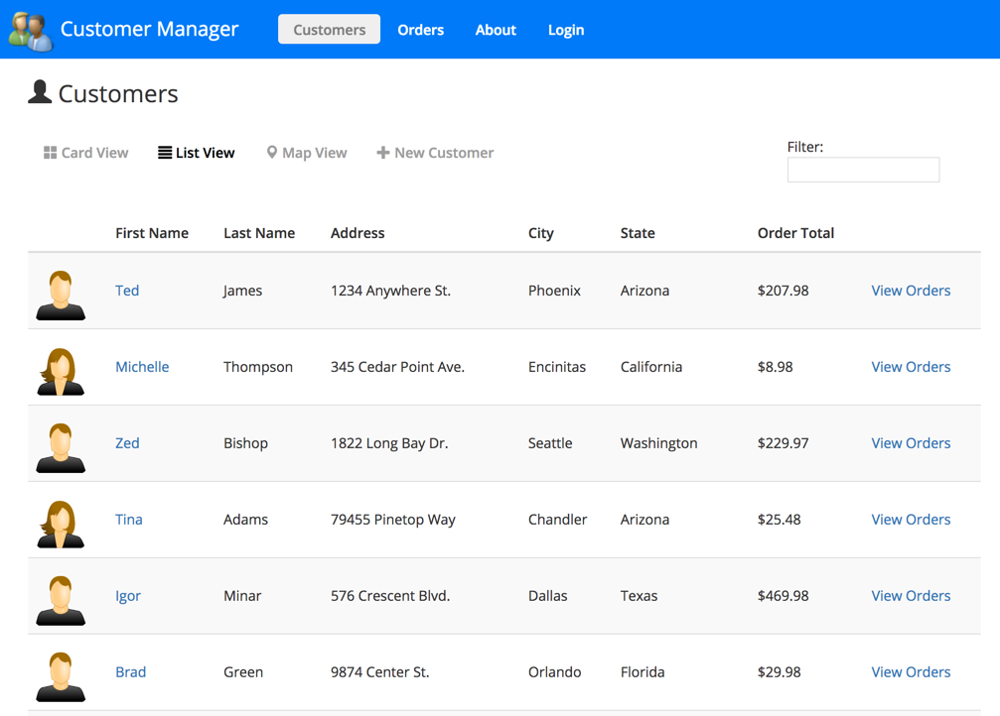

# Aftokinito

aftokinito (from Greek: αυτοκίνητο, aftokínito, meaning car) is a dealership management system (DMS).

The goal of this project is to provide an open source modern application which allows car dealers to manage their finance, sales, parts, inventory and administration. In order to accomplish this, it will pursue deep integration with the the systems of the car makers and service providers.

## Angular JumpStart with TypeScript

This project is based on [Angular JumpStart with TypeScript](https://github.com/DanWahlin/Angular-JumpStart).

## Running the Application

1. Install the latest LTS version of Node.js from https://nodejs.org. _IMPORTANT: The server uses ES2015 features AND the Angular CLI so you need a current version of Node.js._

1. Run `npm install` to install app dependencies

1. Run `ng build --watch` to build and bundle the code

1. Run `npm start` in a separate terminal window to build the TypeScript, watch for changes and launch the web server

1. Go to http://localhost:3000 in your browser

Simply clone the project or download and extract the .zip to get started.

Once the app is running you can play around with editing customers after you login. Use any email address and any password that's at least 6 characters long (with 1 digit).

Here are a few screenshots from the app:

  

  

  

## Running Angular Playground

This application includes Angular Playground (http://www.angularplayground.it) which provides a great way to isolate components in a sandbox rather than loading the
entire application to see a given component. To run the playground run the following command:

`npm run playground`
